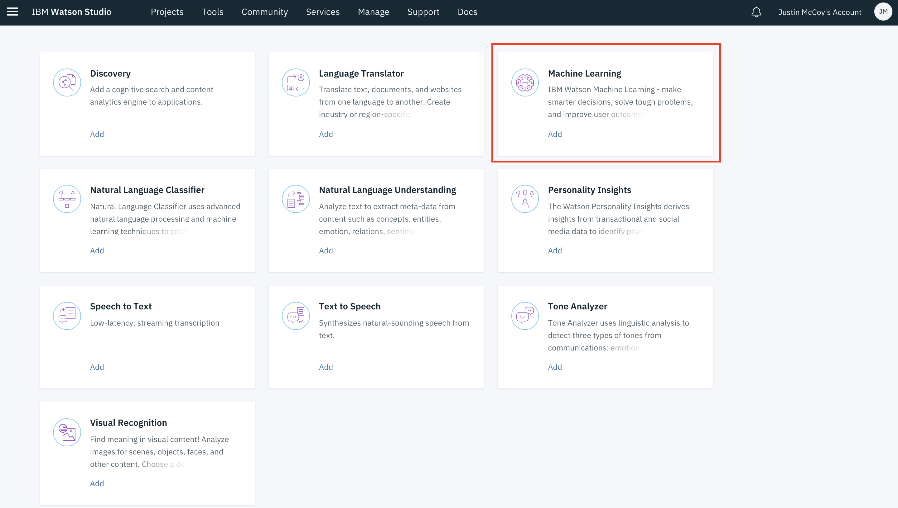
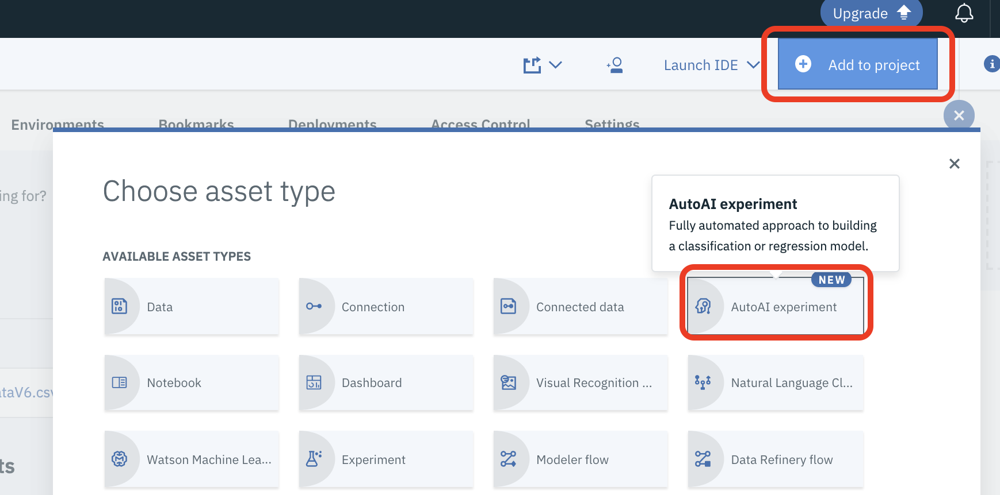
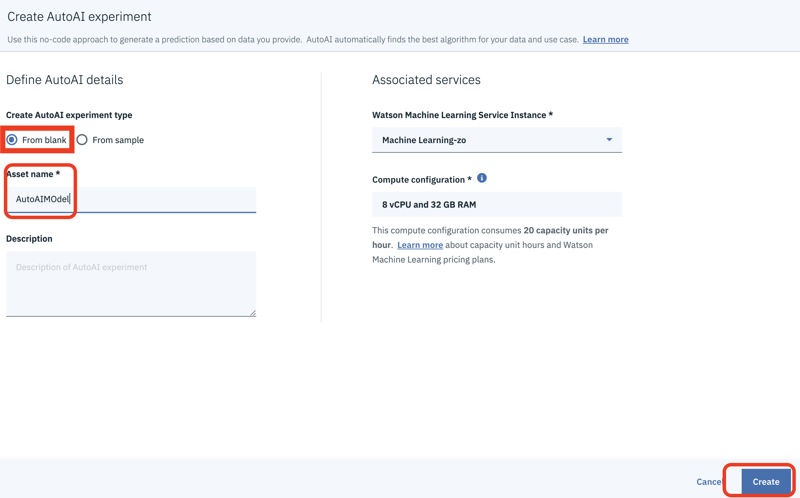
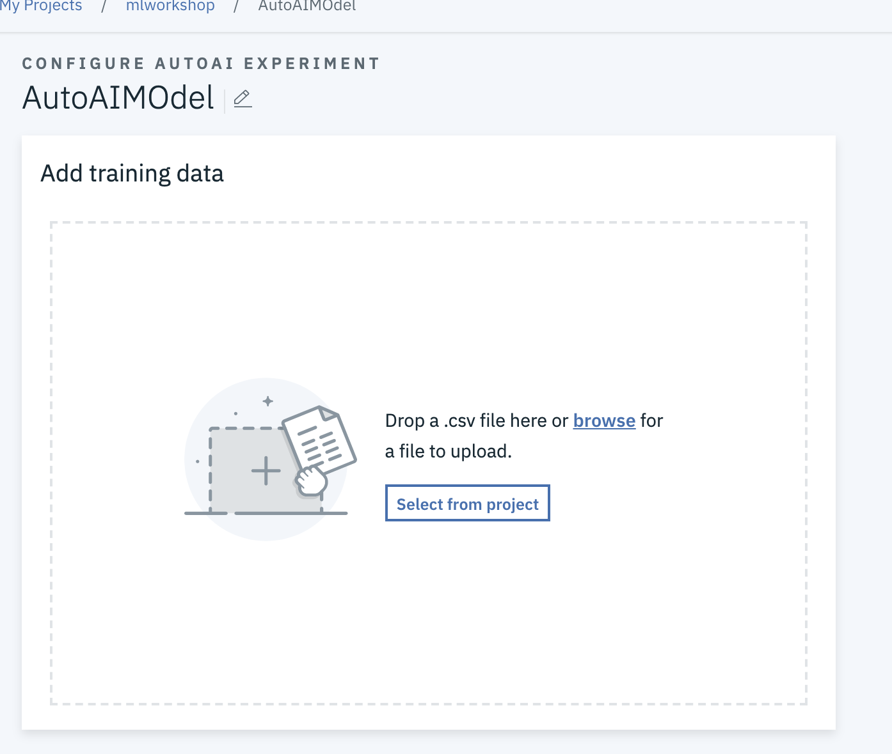
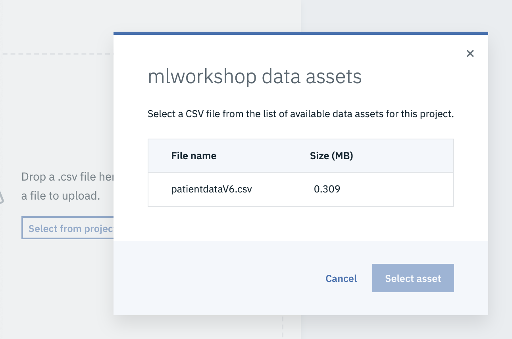
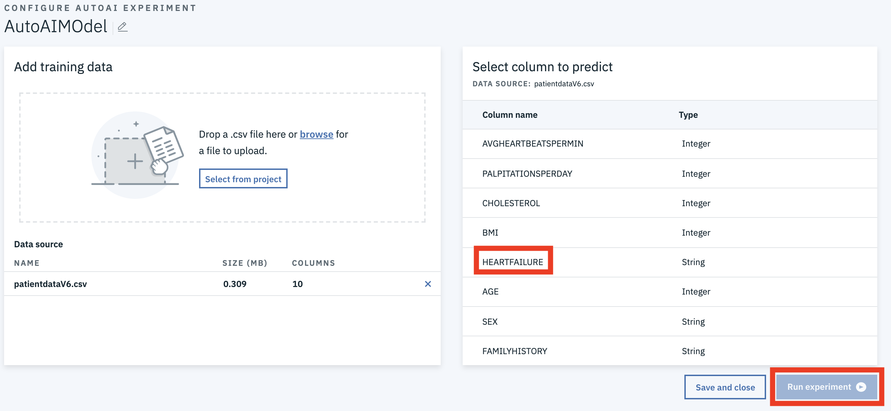
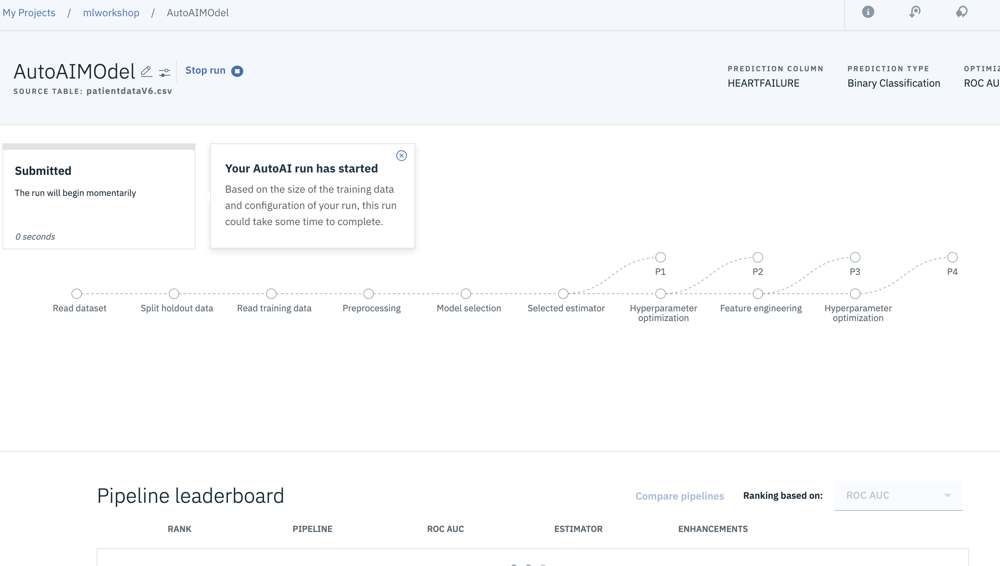
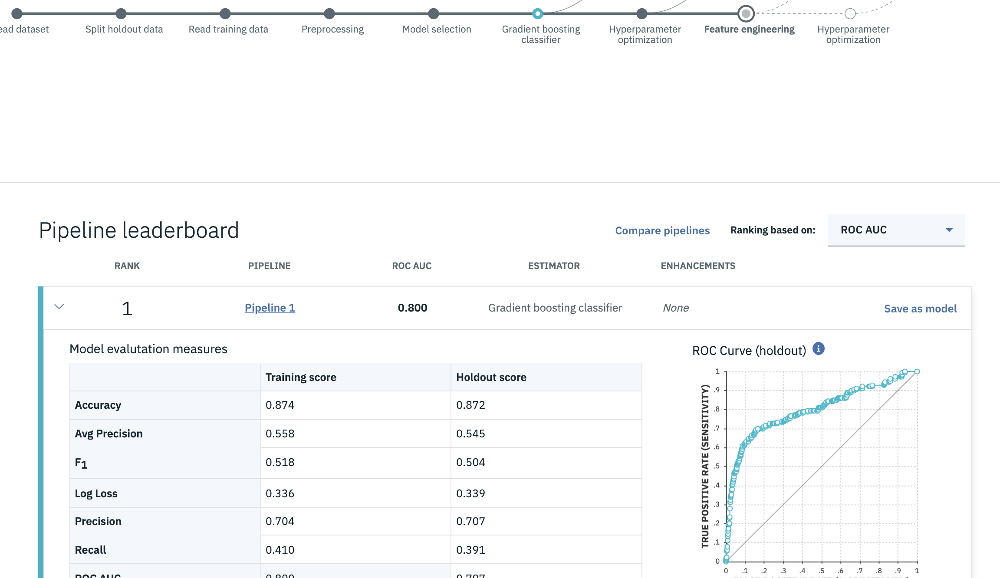
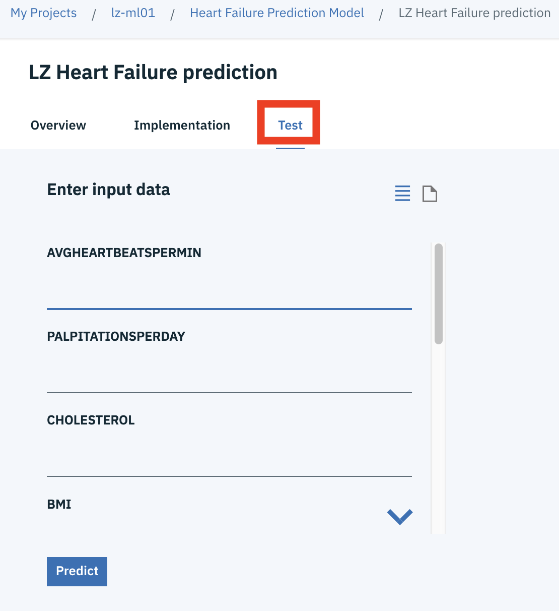

# Build and Deploy an ML model using AutoAI

In this walkthrough we will be building a model using a fully automated capability of Watson Studio and Watson Machine Learning known as Auto AI. 

AutoAI automates the pipeline optimization process that is common to the model development workflow. As part of that optimization process, AutoAI will perform the following:

- Data pre-processing: AutoAI attempts to analyze, clean, and prepare your raw data for machine learning. Automatically detects and categorizes features based on data type and finds best  strategies for missing value imputation, feature encoding, and feature scaling for your data.

- Automated model selection: AutoAI performs testing and ranking of candidate estimators against small subsets of the data set, gradually increasing the size of the subset for the most promising estimators to arrive at the best match.

- Automated feature engineering: Feature engineering attempts to transform the raw data into the combination of features that best represents the problem to achieve the most accurate prediction.

- Hyperparameter optimization: A hyper-parameter optimization step refines the best performing model pipelines.

In the lab we will:

- Create a project in Watson Studio.
- Add dataset to project.
- Use the AutoAI Experiment.

## Included components

- [IBM Watson Studio](https://www.ibm.com/cloud/watson-studio): Analyze data using RStudio, Jupyter, and Python in a configured, collaborative environment that includes IBM value-adds, such as managed Spark.

### Prerequisites

- The data used in these labs are contained in this repository. Ensure you have downloaded / cloned the repository per instructions in the [README](READMe.md).

- It is assumed you have your environment set up with either lite or payed versions of Watson Studio and Watson Machine Learning. If not, contact the lab instructor or set up your own lite instances as detailed in the [Setup Environment readme](EnvironmentSetup.md)

## Step 1: Setup Project

1. Open Watson Studio by logging in at [https://dataplatform.ibm.com](https://dataplatform.ibm.com)

1. From the dashboard page, Click the **`Get started`** drop down menu on the top right of the page and then Click on the **`Create a project`** option to create a new project on Watson Studio.

    

1. Select option `Select an empty project`.

1. Give your project a name and click **`Create`** on the bottom right.

    

1. Next we have to associate a Watson Machine Learning service to the project. Click on `Settings` on the top banner of the project, then `Add Service` under `Associate Services` and finally, select `Watson` to add a Watson service to the project.

    

1. Select `Machine Learning` from the list of available Watson Services.

    

1. Click on the `Existing` tab and select the name of your Machine Learning service instance.

    

1. Click `Select`.

1. The Watson Machine Learning service is now listed as one of your `Associated Services`.

## Step 2: Add Data Set

1. Click the `Assets` tab of the project near the top of the page. Then click `Add to project` on the top right, selecting `Data`.

    

    A panel on the right of the screen appears, select `Load` and click on `Browse` to upload the data file you'll use to create a predictive model.

    

1. On your machine, browse to the location of the file **patientdataV6.csv** in this repository in the **data/** directory. Select the file and click on Open (or the equivalent action for your operating system). Once successfully uploaded, the file should appear in the `Data Assets` section of `Assets`.

## Step 3: Build Modeler Flow

1. AutoAI uses your data set to generate candidate model pipelines. It will use your dataset to discover data transformations, estimator algorithms, and parameter settings that work best for your model.

1. To get started, from your main project page. Click on the **`Add to project`** button and select the `AutoAI experiment` option.
    

1. In the experiment definition screen, select the `From blank` option under `Create AutoAI experiment type`.

1. Give your experiment a name. If you have a single Machine Learning service associated to your project, it will selected in the drop down list. Note that the compute configuration can not currently be changed in the beta of this capability. Click the **`Create`** button.
    

1. Next we need to give AutoAI the data that the model will be built on. Click the **`Select from project`** button.
    

1. In the data selection window, select the data file that you uploaded to your project earlier, then click **`Select asset`**
    

1. AutoAI will determine the data types and you will select the column to predict (i.e the target or the label). Select the `HEARTFAILURE` column and click the **`Run experiment`** button.

    

1. AutoAI will start the experiment process, cleaning/preprocessing the data set, selecting the best base model/evaluator and then running multiple pipelines. This process may take a while but as the pipelines are built and tested, you will see them appear in the leader board.

    

1. As the pipelines appear in the leader board, you can expand them to view the details of the pipeline experiment and results.

    

1. Once the experiment completes, the UI will display the best performing model at the top of the leaderboard.

    

1. One of the capabilities of AutoAI is to perform feature engineering. You can click into the pipeline in your experiment that contained the feature engineering step and view the data transformation that were applied. _Note that your pipeline may be different_

    

1. Once the experiment has completed, we have the option to save the best model. If you click on the `Save model` button next to the top pipeline you can save the model. Just give the model a name and click the **`Save`** button.

    

## [Optional] Step 4: Deploy the Machine Learning model

Although training is a critical step in the machine learning process, the model still needs to be packaged, fronted with an API, and deployed as a web service. Watson Machine Learning streamlines deployment of machine learning models into production.

1. Starting from projects page in Watson Studio, you should see an additional asset has been added to the project. The newly trained and saved model you created above should be visible.

1. Select the model from the project view, then select `Deployments` from the model view, and finally select `Add Deployment`.

1. Name the deployment something unique and click `Save`.

1. The model is quickly packaged and deployed. Upon completion you will have a new deployment of the trained machine learning model; every trained model can have many deployments.

## [Optional] Step 5: Test the Model

1. Aside from testing the model within the notebook. You can test the model using the Watson Studio Interface.

1. Click on the `Deployment` tab on the top of the project page and then click the name you used to create the deployment of your model

   

1. Enter some values in the form and click the `Predict` button.

   
