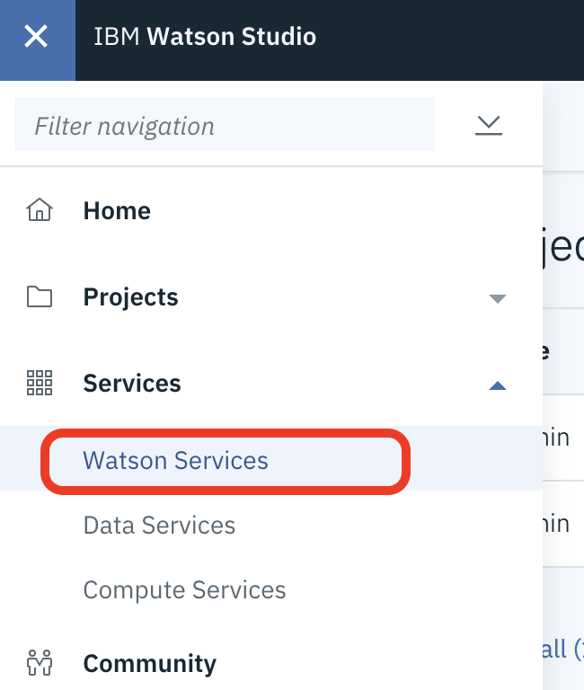
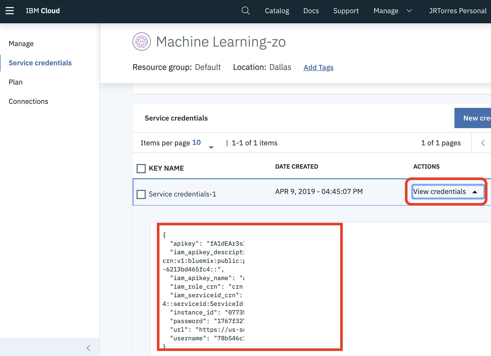

# Build and Deploy an ML model using code

In this walkthrough we will be building a model. The flow of this walkthrough is:

- Create a project and a Jupyter Notebook in Watson Studio.
- Run the notebook to build a model
- Deploy the model to the IBM Watson Machine Learning service

## Included components

- [IBM Watson Studio](https://www.ibm.com/cloud/watson-studio): Analyze data using RStudio, Jupyter, and Python in a configured, collaborative environment that includes IBM value-adds, such as managed Spark.
- [Jupyter Notebook](https://jupyter.org/): An open source web application that allows you to create and share documents that contain live code, equations, visualizations, and explanatory text.
- [PixieDust](https://github.com/pixiedust/pixiedust): Provides a Python helper library for IPython Notebook.

### Prerequisites

- The data and Jupyter notebooks used in these labs are contained in this repository. Ensure you have downloaded / cloned the repository per instructions in the [README](READMe.md).

- It is assumed you have your environment set up with either lite or payed versions of Watson Studio and Watson Machine Learning. If not, contact the lab instructor or set up your own lite instances as detailed in the [Setup Environment readme](EnvironmentSetup.md)

## Step 1: Gather WML Credentials

1. To access the Watson Machine Learning service from SDKs and within Jupyter Notebooks the service credentials are necessary.

1. To get the Watson Machine Learning service credentials from the Watson Studio page (https://dataplatform.ibm.com) click the three horizontal bars in the upper left corner and click `Watson Services`.

    

1. Click on the name of your machine learning instance in the list under "Machine Learning"

1. From within the Watson Machine Learning Service details, select `Service Credentials` from the left menu.  Click on `View Credentials` and copy the credentials for the Watson Machine Learning Service.

    

## Step 2: Setup Project and Data

1. Open Watson Studio by logging in at [https://dataplatform.ibm.com](https://dataplatform.ibm.com)

1. From the dashboard page, Click the **`Get started`** drop down menu on the top right of the page and then Click on the **`Create a project`** option to create a new project on Watson Studio.

    

1. Select `Standard` as the type of project to create.

1. Give your project a name and click **`Create`** on the bottom right.

    

1. Next we have to associate a Watson Machine Learning service to the project. Click on `Settings` on the top banner of the project, then `Add Service` under `Associate Services` and finally, select `Watson` to add a Watson service to the project.

    

1. Select `Machine Learning` from the list of available Watson Services.

    

1. Click on the `Existing` tab and select the name of your Machine Learning service instance.

    
  
1. The Watson Machine Learning service is now listed as one of your `Associated Services`.

## Step 3: Add / Run Notebook

1. Click the `Assets` tab of the project near the top of the page.

1. Add a new notebook. Click `Add to project` and choose `Notebook`:

   

1. Choose new notebook `From File`. Give your notebook a name and choose the notebook file from the downloaded repository (`dsai_machinelearning/notebooks/sparkmodel.ipynb`).

   

1. For `Runtime`be sure to select the one with Spark and Python 3.5, then click `Create Notebook`.

   

1. The notebook will load, use the instructions in the notebook by running through the cells. Click the `(►) Run` button to start stepping through the notebook. **Important** when the code in a cell is still running, the label to the left changes to **In [\*]**. Do **not** continue to the next cell until the code is finished running.

## [Optional] Step 4: Test the Model

1. Aside from testing the model within the notebook. You can test the model using the Watson Studio Interface.

1. Click on the `Deployment` tab on the top of the project page and then click the name you used to create the deployment of your model

   

1. Enter some values in the form and click the `Predict` button.

   