# Build and Deploy an ML model using SPSS Modeler

In this walkthrough we will be building a model using a visual model building tool. The flow of this walkthrough is:

- Create a project.
- Create a modeler flow.

## Included components

- [IBM Watson Studio](https://www.ibm.com/cloud/watson-studio): Analyze data using RStudio, Jupyter, and Python in a configured, collaborative environment that includes IBM value-adds, such as managed Spark.

### Prerequisites

- The data and Jupyter notebooks used in these labs are contained in this repository. Ensure you have downloaded / cloned the repository per instructions in the [README](READMe.md).

- It is assumed you have your environment set up with either lite or payed versions of Watson Studio and Watson Machine Learning. If not, contact the lab instructor or set up your own lite instances as detailed in the [Setup Environment readme](EnvironmentSetup.md)

## Step 1: Setup Project and Data

1. Open Watson Studio by logging in at [https://dataplatform.ibm.com](https://dataplatform.ibm.com)

1. From the dashboard page, Click the **`Get started`** drop down menu on the top right of the page and then Click on the **`Create a project`** option to create a new project on Watson Studio.

    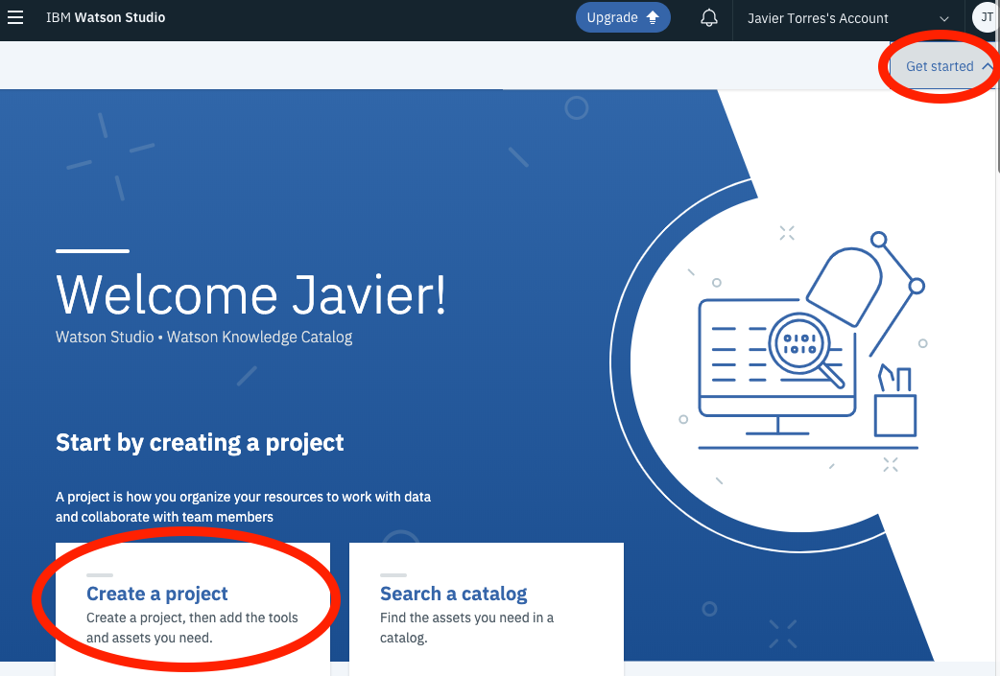

1. Select `Standard` as the type of project to create.

1. Give your project a name and click **`Create`** on the bottom right.

    

1. Next we have to associate a Watson Machine Learning service to the project. Click on `Settings` on the top banner of the project, then `Add Service` under `Associate Services` and finally, select `Watson` to add a Watson service to the project.

    

1. Select `Machine Learning` from the list of available Watson Services.

    

1. Click on the `Existing` tab and select the name of your Machine Learning service instance.

    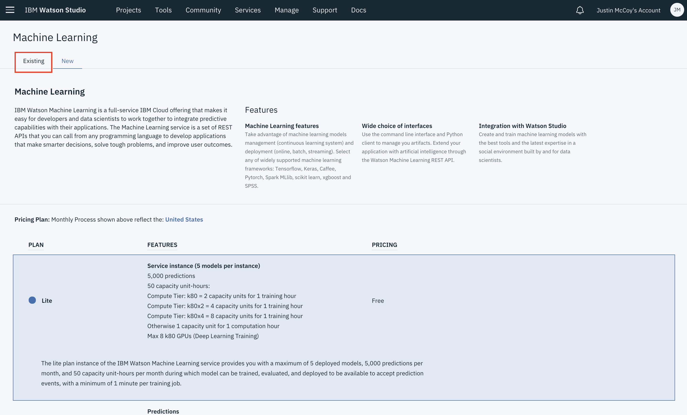
  
1. The Watson Machine Learning service is now listed as one of your `Associated Services`.

## Step 2: Add Data Set

1. Click the `Assets` tab of the project near the top of the page. Then click `Add to project` on the top right, selecting `Data`.

    

    A panel on the right of the screen appears, select `Load` and click on `Browse` to upload the data file you'll use to create a predictive model.

    

1. On your machine, browse to the location of the file **patientdataV6.csv** in this repository in the **data/** directory. Select the file and click on Open (or the equivalent action for your operating system). Once successfully uploaded, the file should appear in the `Data Assets` section of `Assets`.

## Step 3: Create Modeler Flow

1. From your main project page, Click the **`Add to project`** button and select the `Modeler Flow` option.

    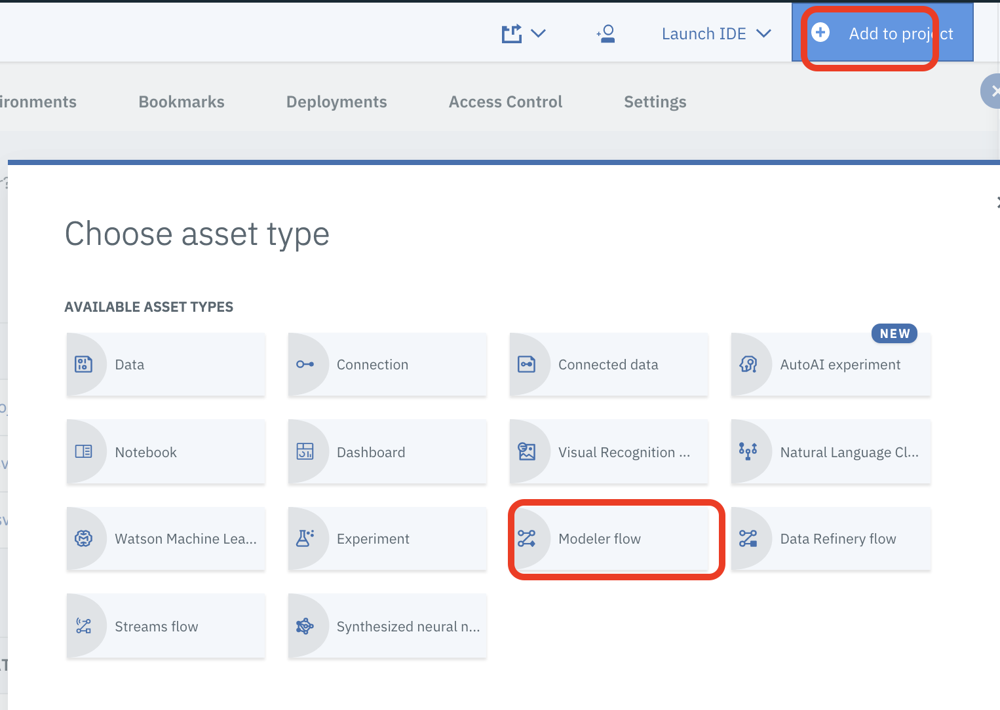

1. Give the new flow a name and click the **`Create`** button.

    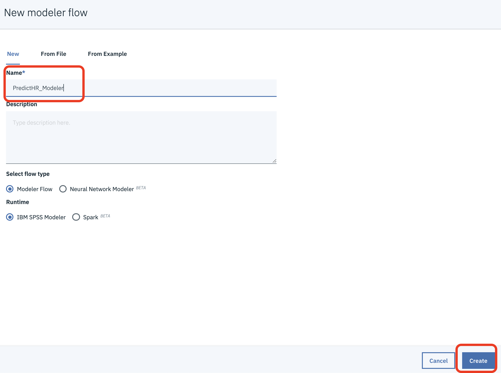

1. A modeler canvas will open, we start by importing the dataset we will be using. From the `Import` section of the palette, select the `Data Asset` node and drop it on to the canvas.

    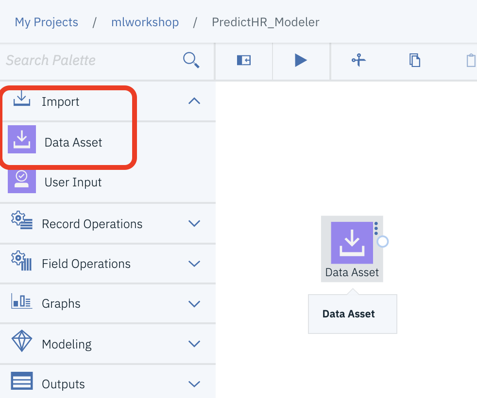

1. Double click on the new data asset node, under Data assets, select the data set we imported into our project.

    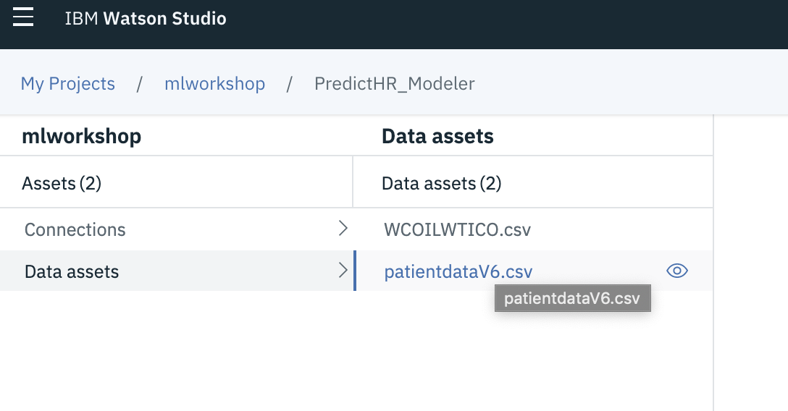

1. Click the **`Save`** button
    

1. To see data or any kind of output, we have to add output nodes to the flow. Click the `Outputs` section of the palette and drag and drop a `Data Audit` node and wire the two nodes together

    

1. Click the **`Run`** button on the canvas to see the output (an output panel will open on the right side of the screen).

    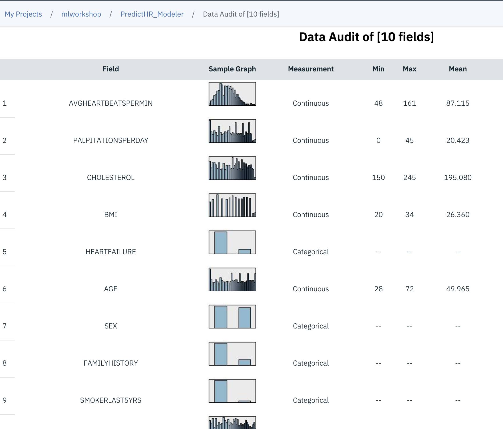

1. You can add graphs to visualize the data as well. Try to drag and drop a Histogram node on to the canvas and wire it to your data set. Click the run button to see the output

    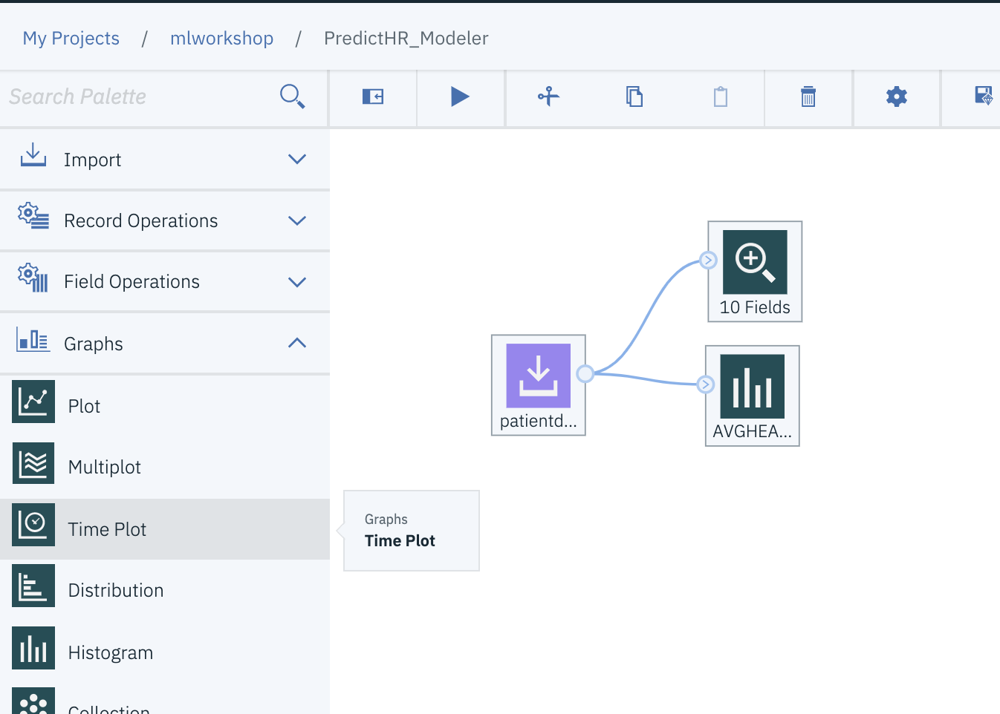

1. Another way to visualize your data is to profile it. Click on the three dots on the data asset node and select profile
    

1. This will bring up data refinery from where you can visualize and prepare data. From top panel, click the **`Visualizations`** tab and select histogram and select the column to visualize

    

1. Back in the modeler flow, we now start to process our data to build a model. Drag and drop a `Type` node to select the data that will be used for the model (i.e. the target)

    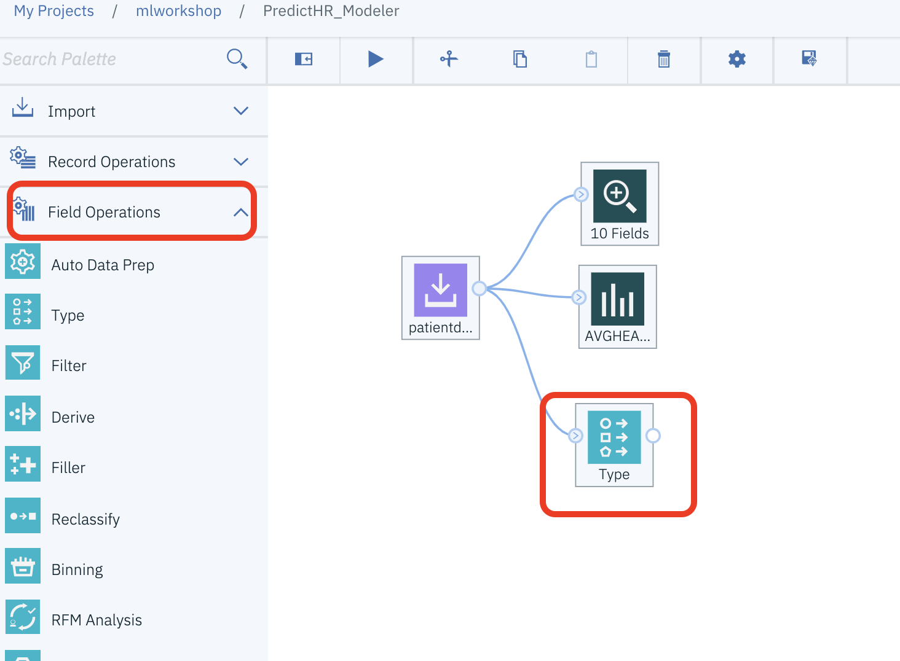

1. Double click the type node and click the ‘READ VALUES’ button and make sure the HEARTFAILURE afield is a TARGET (the label we are looking to predict). Click the **`Save`** button.

1. Now we have the option to start further transform our data set (i.e categorization, scaling, renaming, etc.). One simple approach in this modeler approach is to use the `Auto Data Prep` node. Drag and drop the `Auto Data Prep` node, and wire it to the type node. We could set options in the node to exclude rows or fields. The defaults are okay for this sample.

    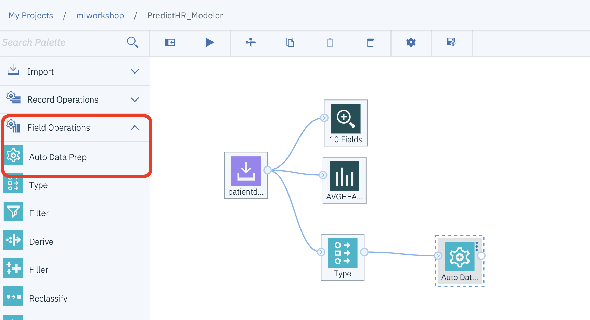

1. If you want you can drop a `Data Audit` or `Table` node to view the state of our data set. After wiring it in, click the run button and in the output of the table, you would see that there are now column field names with an _transformed appendix. These were the features modified/generated by the auto data prep node

1. Next we partition our data set to a train/test set. From the `Field operations` section, drag and drop a `Partition` node and wire it to the AutoData prep node. Double click the node and change it to an 80/20 split, then click the save button

    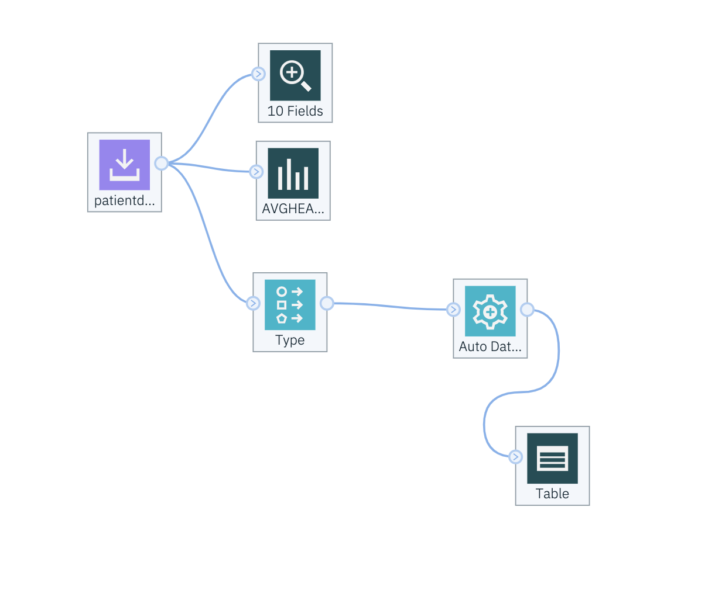

1. Now we are ready to create a model. There are various options, we can either create a specific model type or we can use the auto classifier model type to test a variety of classification models. For this example, lets drop in a `Random Forrest` node from the model section of the palette and wire it to our partition node.

1. Run the model and you will see a new node is auto created in the diagram. The yellow nodes are the actual models that were created. 

    

1. You can even attach some output nodes to the model to view the results. Run the model and open the Analysis output to see how your model performed.

    

1. Feel free to try different models. Try a C5.0 tree and you can View some nice model details by right clicking on the generated yellow node and selecting 'View Model'.

    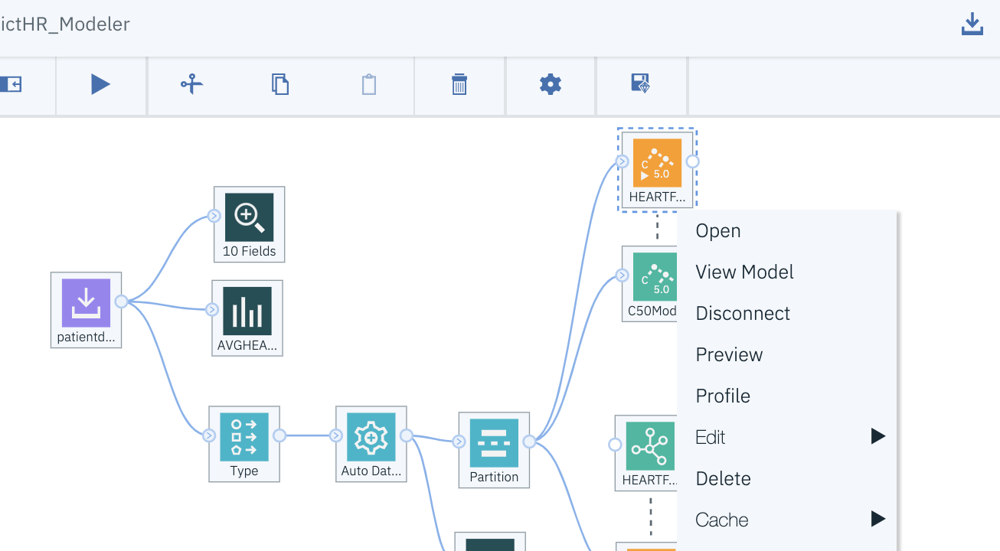

1. You can see things like feature importance, the tree rules, etc.

    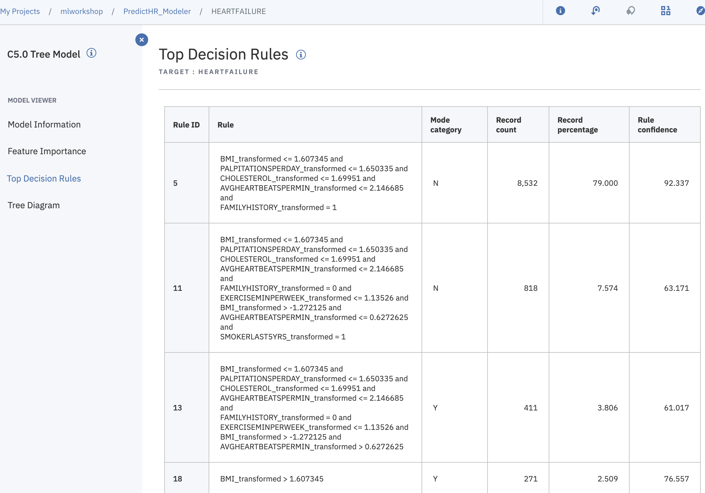

1. (Optional) Once you are happy with the model, you would save it and deploy it. That is outside the scope of this example, but you could try it out by right clicking on the model node and selecting 'Save branch'. That would save the model to your Watson Machine Learning instance, which you could then create a deployment for.
